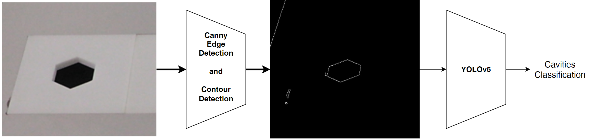

.. _cavity_detection:

Cavity detection
================

For the Precision Placement Task, the robot is required to insert objects into cavities. The correct cavity has to be chosen and the respective object needs to be precisely placed into it. The cavities in the Precision Placement Test are detected by applying Canny edge detection and contour detection and classified using a YOLOv5 network.
